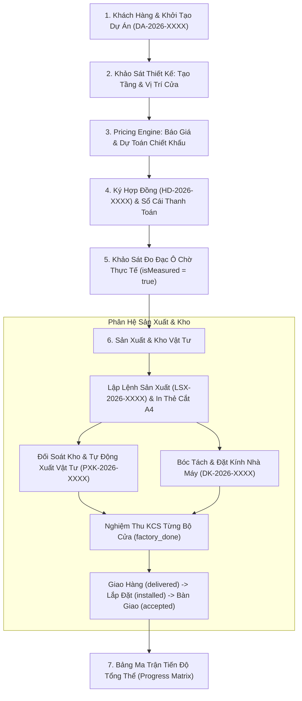

# TỔNG QUAN LUỒNG NGHIỆP VỤ & QUY CHUẨN TÍCH HỢP FRONTEND (STEP 2)

Tài liệu này cung cấp bức tranh toàn cảnh về luồng hoạt động xuyên suốt của hệ thống quản lý sản xuất nhôm kính XT-Tech (Step 2: Project Management & Manufacturing), đồng thời thiết lập các **quy chuẩn bắt buộc** mà Frontend (FE) phải tuân thủ khi giao tiếp với Backend (BE).

---

## 1. Bản Đồ Vòng Đời Dự Án (Project Lifecycle Flow)

Quy trình sản xuất nhôm kính từ giai đoạn tiếp nhận khách hàng đến bàn giao công trình tuân theo 6 chặng liên kết chặt chẽ:



---

## 2. Danh Mục Tài Liệu Hướng Dẫn Từng Module

Frontend phát triển các trang chức năng theo đúng thứ tự logic trong các tài liệu sau:

| STT | Tên Tài Liệu | Nội Dung Nghiệp Vụ Chính |
| :--- | :--- | :--- |
| **001** | [`001_khoi_tao_va_quan_ly_du_an.md`](file:///e:/hoc_ve_fullstash/xttech/xttech-web-v2/docs/step2_project/001_khoi_tao_va_quan_ly_du_an.md) | Khởi tạo dự án, cấu hình nhôm mặc định, danh sách dự án kèm metrics động. |
| **002** | [`002_tang_va_vi_tri_cua_khao_sat.md`](file:///e:/hoc_ve_fullstash/xttech/xttech-web-v2/docs/step2_project/002_tang_va_vi_tri_cua_khao_sat.md) | Quản lý tầng, tạo hàng loạt cửa, đo đạc ô chờ, cảnh báo dung sai, quét QR. |
| **003** | [`003_bao_gia_va_pricing_engine.md`](file:///e:/hoc_ve_fullstash/xttech/xttech-web-v2/docs/step2_project/003_bao_gia_va_pricing_engine.md) | Tính toán giá động (Preview), snapshot mBOM, so sánh các phương án & chốt giá. |
| **004** | [`004_hop_dong_va_thanh_toan_so_cai.md`](file:///e:/hoc_ve_fullstash/xttech/xttech-web-v2/docs/step2_project/004_hop_dong_va_thanh_toan_so_cai.md) | Ký hợp đồng, khóa cứng báo giá, quản lý đợt thanh toán, sổ cái giao dịch bất biến. |
| **005** | [`005_san_xuat_the_a4_va_tien_do.md`](file:///e:/hoc_ve_fullstash/xttech/xttech-web-v2/docs/step2_project/005_san_xuat_the_a4_va_tien_do.md) | Lệnh sản xuất, in Thẻ A4 xưởng, KCS tự động đóng đợt, giao hàng, ma trận tiến độ. |
| **006** | [`006_kho_vat_tu_va_dat_kinh_nha_may.md`](file:///e:/hoc_ve_fullstash/xttech/xttech-web-v2/docs/step2_project/006_kho_vat_tu_va_dat_kinh_nha_may.md) | Cảnh báo thiếu hụt vật tư, xuất kho giữ chỗ, thu hồi nhôm đề-xê, đơn đặt kính tôi. |

---

## 3. Quy Chuẩn Kỹ Thuật Bắt Buộc Cho Frontend (Frontend Technical Rules)

### Quy chuẩn 1: 100% camelCase cho Dữ Liệu Trao Đổi
- **Backend FastAPI** đã kích hoạt alias generator tự động: **100% dữ liệu JSON serialize trả về Client là `camelCase`** (`customerId`, `defaultBrandId`, `totalPositions`, `totalAreaM2`, `totalPrice`, `contractCode`...).
- **Quy tắc FE:** 
  - Khai báo 100% TypeScript interfaces dạng `camelCase` (`brandId: number`, `aluminumThickness: number`).
  - Truy xuất trực tiếp thuộc tính `camelCase` (`row.aluminumThickness`).
  - 🛑 **TUYỆT ĐỐI KHÔNG DÙNG FALLBACK:** Không viết kiểu `row.aluminumThickness ?? row.aluminum_thickness` hoặc khai báo cả 2 dạng thuộc tính vào interface.

### Quy chuẩn 2: Backend Trả Mã Tiếng Anh (English Codes/Enums) - Frontend Dịch Tiếng Việt
- **Backend tuyệt đối không trả text tiếng Việt có dấu cho các trường enum, status, unit:**
  - `status`: `draft`, `surveying`, `producing`, `completed`, `cancelled`...
  - `unit`: `set`, `pcs`, `meter`, `sheet`, `bar`, `roll`, `box`...
  - `supplierType`: `aluminum`, `accessory`, `glass`, `consumable`...
- **Frontend chịu trách nhiệm hiển thị giao diện:** 
  - Sử dụng Dictionary Mapping (`Record<string, string>`) để render ra nhãn tiếng Việt thân thiện.
  - Ví dụ:
    ```typescript
    export const UNIT_MAP: Record<string, string> = {
      set: 'Bộ',
      pcs: 'Cái',
      meter: 'Mét',
      bar: 'Cây',
      sheet: 'Tấm',
      box: 'Hộp',
      roll: 'Cuộn'
    };
    ```

### Quy chuẩn 3: Kiểm Soát Đồng Thời Bằng Revision ID (Optimistic Locking)
- Các bản ghi vị trí cửa (`ProjectDoorPosition`) có trường `revisionId: number`.
- Khi FE gọi `PUT /api/v1/positions/{id}`, bắt buộc phải gửi kèm `revisionId` hiện tại.
- Nếu Backend trả về **HTTP 409 Conflict**, FE phải hiển thị thông báo: *"Dữ liệu đã được người dùng khác cập nhật, vui lòng tải lại trang để lấy thông tin mới nhất!"* và kích hoạt reload dữ liệu.

### Quy chuẩn 4: Chuẩn Xác Từng Đồng VND (No Floating Point Errors)
- Toàn bộ giá trị tài chính (doanh thu, giá vốn, tiền cọc, nợ còn lại) được làm tròn chính xác từng đồng lẻ VND (`round(..., 0)`).
- Frontend sử dụng `Intl.NumberFormat('vi-VN', { style: 'currency', currency: 'VND' })` để format hiển thị, không tự ý làm tròn sai lệch số thập phân.
