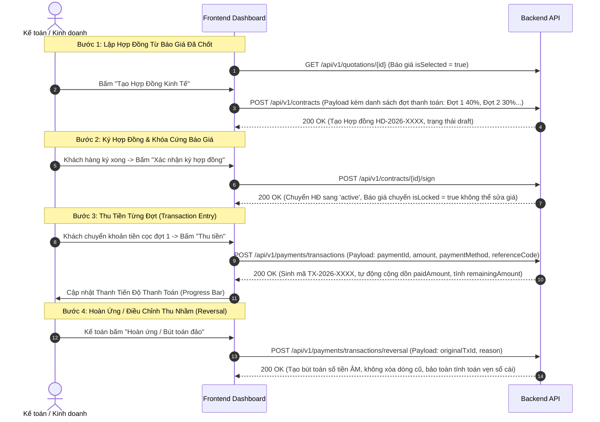

# HƯỚNG DẪN TÍCH HỢP FRONTEND: HỢP ĐỒNG & SỔ CÁI THANH TOÁN (MODULE 004)

Module này quản lý việc ký kết hợp đồng kinh tế dựa trên phương án báo giá đã chốt, chia các mốc thanh toán theo tiến độ thi công (Đặt cọc, Chuẩn bị vật tư, Giao hàng, Nghiệm thu) và vận hành cơ chế **Sổ cái kế toán bất biến (Immutable Financial Ledger)**: Tiền vào/tiền ra được ghi nhận theo từng bút toán, nghiêm cấm xóa/sửa số tiền thực tế và hỗ trợ nghiệp vụ bút toán đảo (Reversal Transaction) khi hoàn ứng hoặc điều chỉnh.

---

## 1. Luồng Thao Tác Của Người Dùng Trên Frontend (UX Flow)



---

## 2. Chi Tiết Các API Call & Chuẩn Dữ Liệu

### 2.1. Tạo Hợp Đồng Mới
- **Endpoint:** `POST /api/v1/contracts`
- **Tác dụng:** Tự sinh mã `HD-YYYY-XXXX`, chia nhỏ giá trị hợp đồng thành các đợt thanh toán (`paymentStages`).
- **Request Body:**
  ```json
  {
    "projectId": 58,
    "quotationId": 27,
    "title": "Hợp đồng thi công lắp đặt cửa nhôm kính Ecopark",
    "contractType": "main",
    "paymentStages": [
      {
        "milestoneName": "Tạm ứng đợt 1 (Ký hợp đồng)",
        "percentage": 40.0,
        "dueDate": "2026-10-20",
        "description": "Tạm ứng mua nguyên vật liệu nhôm kính"
      },
      {
        "milestoneName": "Thanh toán đợt 2 (Giao hàng đến chân công trình)",
        "percentage": 40.0,
        "dueDate": "2026-11-15",
        "description": "Tập kết cửa tại tầng 1"
      },
      {
        "milestoneName": "Quyết toán đợt 3 (Nghiệm thu bàn giao)",
        "percentage": 20.0,
        "dueDate": "2026-12-05",
        "description": "Bàn giao chìa khóa và bảo hành"
      }
    ]
  }
  ```
- **Response Body (200 OK):**
  ```json
  {
    "id": 13,
    "contractCode": "HD-2026-0009",
    "title": "Hợp đồng thi công lắp đặt cửa nhôm kính Ecopark",
    "totalValue": 46124215,
    "status": "draft",
    "payments": [
      {
        "id": 19,
        "milestoneName": "Tạm ứng đợt 1 (Ký hợp đồng)",
        "amount": 18449686,
        "paidAmount": 0,
        "status": "pending"
      }
    ]
  }
  ```

---

### 2.2. Ký Hợp Đồng & Khóa Báo Giá
- **Endpoint:** `POST /api/v1/contracts/{id}/sign`
- **Tác dụng:**
  - Chuyển trạng thái Hợp đồng sang `active`.
  - Khóa vĩnh viễn Báo giá liên kết (`isLocked = true`). Nếu bất kỳ ai cố tình sửa báo giá sau khi đã ký HĐ, Backend sẽ ném lỗi chặn `ForbiddenException` (HTTP 403).
  - Tự động nâng trạng thái dự án lên `contract`.

---

### 2.3. Lập Bút Toán Thu Tiền (Payment Transaction)
- **Endpoint:** `POST /api/v1/payments/transactions`
- **Tác dụng:** Ghi nhận một giao dịch tài chính phát sinh vào sổ cái. Hệ thống tự động sinh mã bút toán `TX-YYYY-XXXX`.
- **Request Body:**
  ```json
  {
    "paymentId": 19,
    "amount": 18449686,
    "paymentMethod": "bank_transfer",
    "referenceCode": "MBBANK_FT12345678",
    "receiptProofUrl": "https://cdn.xttech.vn/proofs/mb_tx123.jpg",
    "note": "Khách hàng Nguyễn Văn A chuyển khoản cọc đợt 1"
  }
  ```
- **Response Body (200 OK):**
  ```json
  {
    "id": 19,
    "transactionCode": "TX-2026-0019",
    "amount": 18449686,
    "paymentMethod": "bank_transfer",
    "referenceCode": "MBBANK_FT12345678",
    "transactionType": "payment",
    "createdAt": "2026-10-08T09:41:17Z",
    "payment": {
      "id": 19,
      "amount": 18449686,
      "paidAmount": 18449686,
      "remainingAmount": 0,
      "status": "completed"
    }
  }
  ```

---

### 2.4. Bút Toán Đảo Hoàn Ứng / Điều Chỉnh (Reversal Transaction)
- **Endpoint:** `POST /api/v1/payments/transactions/reversal`
- **Nguyên tắc kế toán bất biến:** Nghiêm cấm câu lệnh `DELETE FROM payment_transactions` hay `UPDATE amount`. Khi cần hoàn trả tiền cho khách hàng hoặc hủy bút toán thu nhầm, Backend sẽ tạo một giao dịch mới với **số tiền ÂM (`-amount`)** và liên kết đến giao dịch gốc thông qua trường `reversalOfId`.
- **Request Body:**
  ```json
  {
    "originalTransactionId": 19,
    "reversalReason": "Khách chuyển nhầm dư tiền cần hoàn trả lại tài khoản chính chủ"
  }
  ```
- **Response Body (200 OK):**
  ```json
  {
    "id": 20,
    "transactionCode": "TX-2026-0020",
    "amount": -18449686,
    "transactionType": "reversal",
    "reversalOfId": 19,
    "note": "Bút toán đảo cho giao dịch TX-2026-0019. Lý do: Khách chuyển nhầm dư tiền cần hoàn trả lại tài khoản chính chủ"
  }
  ```

---

## 3. Bảng Ánh Xạ Từ Điển (Dictionary Mapping) Cho Frontend

```typescript
export const CONTRACT_STATUS_MAP: Record<string, { label: string; color: string }> = {
  draft:       { label: 'Dự thảo',      color: 'default' },
  active:      { label: 'Có hiệu lực',  color: 'success' },
  completed:   { label: 'Thanh lý',     color: 'blue' },
  terminated:  { label: 'Hủy hợp đồng', color: 'error' }
};

export const PAYMENT_METHOD_MAP: Record<string, string> = {
  cash:          'Tiền mặt',
  bank_transfer: 'Chuyển khoản ngân hàng',
  credit_card:   'Thẻ tín dụng / POS',
  other:         'Khác'
};

export const PAYMENT_STATUS_MAP: Record<string, { label: string; color: string }> = {
  pending:    { label: 'Chờ thanh toán', color: 'warning' },
  partial:    { label: 'Đã thanh toán một phần', color: 'processing' },
  completed:  { label: 'Đã hoàn tất',    color: 'success' },
  overdue:    { label: 'Quá hạn',        color: 'error' }
};
```
