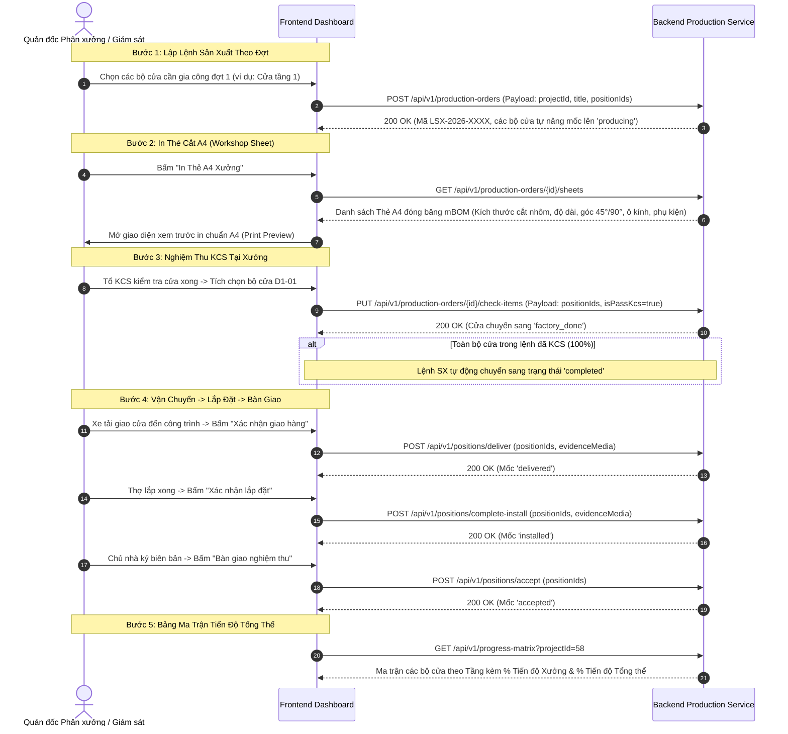

# HƯỚNG DẪN TÍCH HỢP FRONTEND: SẢN XUẤT, THẺ CẮT A4 & MA TRẬN TIẾN ĐỘ (MODULE 005)

Module này số hóa toàn bộ quá trình sản xuất tại phân xưởng và thi công ngoài công trình: Gom các bộ cửa thành **Lệnh sản xuất (Production Orders)** theo đợt thi công, kết xuất **Thẻ cắt A4 (Workshop Cutting Sheets)** cho tổ thợ, kiểm soát chất lượng KCS với cơ chế **tự động đóng đợt khi hoàn tất 100%**, ghi nhận giao hàng/lắp đặt/bàn giao kèm ảnh hiện trường, và hiển thị **Bảng ma trận tiến độ (Progress Matrix)** tính theo trọng số diện tích $m^2$.

---

## 1. Luồng Thao Tác Của Người Dùng Trên Frontend (UX Flow)



---

## 2. Chi Tiết Các API Call & Chuẩn Dữ Liệu

### 2.1. Lập Lệnh Sản Xuất Mới
- **Endpoint:** `POST /api/v1/production-orders`
- **Tác dụng:** Gom danh sách vị trí cửa vào một lệnh gia công đợt, tự sinh mã `LSX-YYYY-XXXX`.
- **Hàng rào bảo vệ (Guardrail):** Backend tự động chặn gán trùng lặp: Nếu một bộ cửa đã thuộc lệnh sản xuất khác đang hoạt động (`in_progress`), Backend sẽ trả về lỗi `BadRequestError` (HTTP 400).
- **Request Body:**
  ```json
  {
    "projectId": 58,
    "title": "Sản xuất đợt 1 - Cửa đi phòng khách & Cửa sổ bếp",
    "startDate": "2026-10-18",
    "targetDate": "2026-10-25",
    "positionIds": [107, 108],
    "note": "Ưu tiên cắt trước bộ cửa mặt tiền"
  }
  ```
- **Response Body (200 OK):**
  ```json
  {
    "id": 14,
    "code": "LSX-2026-0015",
    "title": "Sản xuất đợt 1 - Cửa đi phòng khách & Cửa sổ bếp",
    "status": "in_progress",
    "totalPositions": 2,
    "items": [
      {
        "positionId": 107,
        "floorName": "Tầng 1",
        "positionCode": "D1-01",
        "doorName": "Cửa đi chính 4 cánh"
      }
    ]
  }
  ```

---

### 2.2. Lấy Dữ Liệu In Thẻ Cắt A4 (Workshop Sheet)
- **Endpoint:** `GET /api/v1/production-orders/{id}/sheets`
- **Tác dụng:** Trả về toàn bộ danh mục bóc tách mBOM đóng băng của từng bộ cửa để hiển thị biểu mẫu in A4 cho thợ xưởng.
- **Cấu trúc dữ liệu Thẻ A4:**
  ```json
  {
    "productionOrderId": 14,
    "orderCode": "LSX-2026-0015",
    "sheets": [
      {
        "positionCode": "D1-01",
        "doorName": "Cửa đi chính 4 cánh",
        "floorName": "Tầng 1",
        "width": 2800.0,
        "height": 2400.0,
        "aluminumProfiles": [
          { "barCode": "XF55-KB", "barName": "Khung bao", "cutLength": 2800.0, "angleLeft": 45, "angleRight": 45, "quantity": 2 }
        ],
        "glasses": [
          { "glassType": "Kính cường lực 8mm", "width": 550.0, "height": 2150.0, "quantity": 4 }
        ],
        "accessories": [
          { "itemCode": "ACC-BL4D", "itemName": "Bản lề 4D Kinlong", "quantity": 12, "unit": "pcs" }
        ]
      }
    ]
  }
  ```

---

### 2.3. Nghiệm Thu KCS Xưởng & Tự Động Đóng Đợt
- **Endpoint:** `PUT /api/v1/production-orders/{id}/check-items`
- **Tác dụng:** Đánh dấu kiểm tra chất lượng (KCS) hoàn tất tại xưởng cho danh sách vị trí cửa.
- **Request Body:**
  ```json
  {
    "positionIds": [107],
    "isPassKcs": true,
    "kcsNote": "Ép góc khít, gioăng cao su lắp phẳng, bọc màng PE bảo vệ"
  }
  ```
- **Cơ chế tự động:** Khi nghiệm thu đến bộ cửa cuối cùng của lệnh (tỷ lệ KCS = 100%), lệnh sản xuất sẽ **tự động chuyển trạng thái sang `completed`**.

---

### 2.4. Xác Nhận Giao Hàng, Lắp Đặt & Nghiệm Thu Bàn Giao
Các endpoint này dùng Pydantic schema chuẩn **`camelCase`** (`positionIds`, `evidenceMedia`):

1. **Giao hàng đến chân công trình:**
   - `POST /api/v1/positions/deliver`
   - Request Body:
     ```json
     {
       "positionIds": [107],
       "note": "Xe tải chở tập kết tại tầng 1 công trình",
       "evidenceMedia": ["https://cdn.xttech.vn/proofs/delivery_p1.jpg"]
     }
     ```
2. **Lắp đặt hoàn thiện:**
   - `POST /api/v1/positions/complete-install`
   - Request Body:
     ```json
     {
       "positionIds": [107],
       "note": "Tổ lắp đặt đã cân chỉnh bản lề và bắn keo silicon kín khít",
       "evidenceMedia": ["https://cdn.xttech.vn/proofs/install_p1.jpg"]
     }
     ```
3. **Chủ nhà ký biên bản bàn giao nghiệm thu:**
   - `POST /api/v1/positions/accept`
   - Request Body:
     ```json
     {
       "positionIds": [107],
       "note": "Chủ nhà ký biên bản bàn giao không lỗi"
     }
     ```

---

### 2.5. Bảng Ma Trận Tiến Độ Tổng Thể (Progress Matrix)
- **Endpoint:** `GET /api/v1/progress-matrix?projectId={projectId}`
- **Tác dụng:** Trả về ma trận lưới (Grid) toàn bộ vị trí cửa theo từng tầng để FE render bảng trực quan (mỗi ô là 1 vị trí cửa với màu tương ứng theo tiến độ).
- **Công thức tính % Tiến độ có trọng số diện tích ($m^2$):**
  - **Tiến độ Xưởng (%):** Tính trên các cửa đã đạt từ mốc `factory_done` trở lên:
    $$\% \text{Xưởng} = \frac{\sum (S_{m2} \text{ của cửa } \ge \text{factory\_done})}{\sum S_{m2} \text{ toàn dự án}} \times 100$$
  - **Tiến độ Tổng thể (%):** Tính theo tỷ trọng đóng góp từng giai đoạn (Đo đạc 10%, Sản xuất 40%, Giao hàng 20%, Lắp đặt 20%, Nghiệm thu 10%).
- **Response Body (200 OK):**
  ```json
  {
    "projectId": 58,
    "totalPositions": 3,
    "factoryProgressPercent": 87.8,
    "overallProgressPercent": 84.6,
    "matrix": [
      {
        "floorId": 46,
        "floorName": "Tầng 1",
        "positions": [
          { "id": 107, "code": "D1-01", "name": "Cửa đi 4 cánh", "areaM2": 6.72, "status": "accepted" },
          { "id": 108, "code": "S1-01", "name": "Cửa sổ lùa", "areaM2": 2.24, "status": "factory_done" }
        ]
      }
    ]
  }
  ```

---

## 3. Bảng Ánh Xạ Từ Điển (Dictionary Mapping) Cho Frontend

```typescript
export const PROGRESS_STEP_MAP: Record<string, { label: string; color: string }> = {
  draft:        { label: 'Bản vẽ sơ bộ',   color: '#d9d9d9' },
  surveyed:     { label: 'Đã đo ô chờ',    color: '#1890ff' },
  producing:    { label: 'Đang sản xuất',  color: '#fa8c16' },
  factory_done: { label: 'Xuất xưởng',     color: '#13c2c2' },
  delivered:    { label: 'Đã giao hàng',   color: '#722ed1' },
  installed:    { label: 'Đã lắp đặt',     color: '#2f54eb' },
  accepted:     { label: 'Bàn giao xong',  color: '#52c41a' }
};
```
