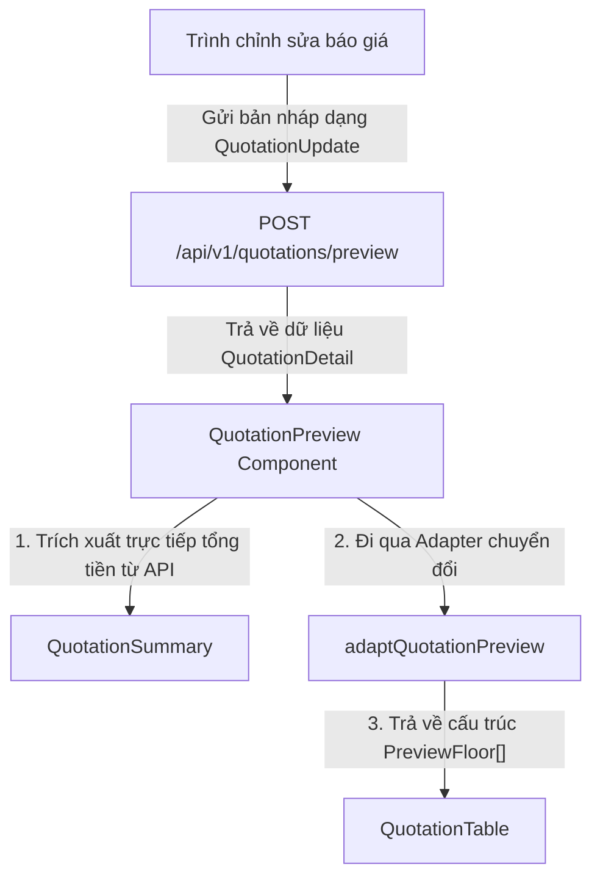

# Tài Liệu Hướng Dẫn: Xem Trước Báo Giá (Quotation Preview)

Tài liệu này mô tả chi tiết cách thức hoạt động của luồng xử lý dữ liệu xem trước báo giá (Preview) thời gian thực, cơ chế hoạt động của Adapter, và cấu trúc ánh xạ dữ liệu từ API Response lên giao diện (UI Preview).

---

## 1. Cơ Chế Hoạt Động Của Luồng Preview

Luồng dữ liệu của chức năng Live Preview được thiết kế chạy song song với trình chỉnh sửa báo giá:

### A. Cơ Chế Hoạt Động Của Adapter (`adaptQuotationPreview`)
* **Mục đích:** Nhận đối tượng báo giá chi tiết từ API (`QuotationDetail`) và chuyển đổi (adapt) cấu trúc dữ liệu thô từ backend thành một danh sách có cấu trúc phù hợp (`PreviewFloor[]`) để truyền trực tiếp xuống `QuotationTable` hiển thị.
* **Tối giản hóa dữ liệu:** Chỉ chọn lọc, map đúng và đủ các thông tin cần thiết phục vụ cho việc hiển thị hoặc khóa ngoại hiển thị (như `id`, `doorId`, `materialId` để tìm thông tin ảnh, tên sản phẩm đầy đủ từ master list), loại bỏ hoàn toàn các trường dữ liệu thừa thãi không hiển thị trên giao diện (như `accessoryIds`, `extraOptionIds` ở cấp cửa).
* **Đồng bộ hóa trường giá và diện tích:** Đảm bảo toàn bộ các trường số lượng (`quantity`), diện tích (`totalArea`), đơn giá (`initPrice`), thành tiền (`totalPrice`) của từng tầng, hệ nhôm và cửa được map đồng bộ.

### B. Cách Thức Hoạt Động Của Preview Component
* **Dữ liệu bảng (`QuotationTable`):** Nhận danh sách các tầng đã đi qua Adapter (`adaptedFloors`), kết hợp với master data (`materialsList`, `doorsList`) để hiển thị đầy đủ hình ảnh sản phẩm, tên chi tiết, và ký hiệu.
* **Dữ liệu tổng kết (`QuotationSummary`):** Sử dụng **100% dữ liệu tính toán từ backend** (`quotation.subtotalPrice` và `quotation.totalPrice`) thay vì tính toán thủ công trên client. Việc này đảm bảo tính chính xác tuyệt đối của phần tổng tiền, chiết khấu và thành tiền hiển thị cuối cùng, tránh mọi sai lệch do làm tròn số ở client.

---

## 2. Bảng Ánh Xạ Dữ Liệu Chi Tiết (API Response vs UI Preview)

Dưới đây là chi tiết nguồn gốc dữ liệu hiển thị cho từng cột trên bảng preview:

### A. Dòng Tầng (Floor Row) - Ví dụ: `TẦNG 1`
| Cột trên UI | Giá trị trên UI | Thuộc tính trong JSON API | Ghi chú / Công thức chuyển đổi |
| :--- | :--- | :--- | :--- |
| **TT** | A, B, C... | Index của floor trong mảng | Chuyển index số (`0, 1...`) sang chữ cái (`A, B...`) |
| **Tên sản phẩm** | TẦNG 1 | `floor.name` | Viết hoa (`toUpperCase()`) |
| **Số lượng** | 8 | `floor.quantity` | Tổng số lượng phần tử (cửa + phụ kiện) trong tầng từ backend |
| **Khối lượng (m2)** | 5.44 | `floor.totalArea` | Tổng diện tích cửa trong tầng |
| **Thành tiền** | 17.898.410 | `floor.totalPrice` | Tổng số tiền của tầng từ backend |

### B. Dòng Hệ Nhôm (Material Row) - Ví dụ: `Nhôm vasco luxury 56...`
| Cột trên UI | Giá trị trên UI | Thuộc tính trong JSON API | Ghi chú / Công thức chuyển đổi |
| :--- | :--- | :--- | :--- |
| **TT** | I, II, III... | Index của material trong mảng | Chuyển index số (`0, 1...`) sang số La Mã (`I, II...`) |
| **Tên sản phẩm** | Nhôm vasco... | `mat.name` | Tên hệ nhôm được hiển thị chi tiết từ `materialsList` bằng `materialId` |
| **Số lượng** | 8 | `mat.quantity` | Tổng số lượng phần tử của hệ nhôm |
| **Khối lượng (m2)** | 5.44 | `mat.totalArea` | Tổng diện tích cửa của hệ nhôm |
| **Thành tiền** | 17.898.410 | `mat.totalPrice` | Tổng số tiền của nhóm hệ nhôm |

### C. Dòng Cửa (Door Row) - Ví dụ: `Cửa sổ 2 mặt tiền`
| Cột trên UI | Giá trị trên UI | Thuộc tính trong JSON API | Ghi chú / Công thức chuyển đổi |
| :--- | :--- | :--- | :--- |
| **TT** | 1, 2, 3... | Bộ đếm tăng dần | Số thứ tự các cửa + phụ kiện + tùy chọn trong nhóm |
| **Hình ảnh** | Ảnh đại diện | `door.imagePath` | Kết hợp với `BASE_MINIO_URL` lấy từ master `doorsList` |
| **Ký hiệu** | CS2MT | `door.code` | Ký hiệu cửa |
| **Tên sản phẩm** | Cửa sổ 2 mặt tiền | `doorName` | Tra cứu tên từ `doorsList` bằng `door.doorId` |
| **Đvt** | m2 | Hardcoded | Cố định là `m2` cho cửa |
| **Rộng (mm)** | 1000 | `door.effectiveWidth` hoặc `door.width` | Kích thước lọt lòng / kích thước cửa |
| **Cao (mm)** | 1000 | `door.effectiveHeight` hoặc `door.height` | Kích thước lọt lòng / kích thước cửa |
| **Số lượng** | 1 | `door.quantity` | Số lượng bộ cửa |
| **Khối lượng (m2)** | 1.00 | `door.totalArea` | Diện tích cửa |
| **Đơn giá** | 2.630.000 | `door.initPrice` | Giá cơ bản của cửa từ backend |
| **Thành tiền** | 2.630.000 | `door.totalPrice` | Tổng tiền của bộ cửa đã được tính toán từ backend |

### D. Dòng Phụ Kiện (Accessory Row) - Ví dụ: `+ Phụ kiện: Tay nắm cửa`
| Cột trên UI | Giá trị trên UI | Thuộc tính trong JSON API | Ghi chú / Công thức chuyển đổi |
| :--- | :--- | :--- | :--- |
| **Ký hiệu** | TNC | `acc.code` | Mã phụ kiện |
| **Tên sản phẩm** | + Phụ kiện: Tay nắm cửa | `acc.name` | Thêm tiền tố `+ Phụ kiện: ` |
| **Đvt** | set | `acc.unit` | Đơn vị tính |
| **Số lượng** | 1 | `acc.totalQuantity` | Tổng số lượng phụ kiện áp dụng |
| **Khối lượng (m2)** | — | Hardcoded | Hiển thị gạch ngang `—` |
| **Đơn giá** | 1.150.000 | `acc.initPrice` | Đơn giá phụ kiện |
| **Thành tiền** | 1.150.000 | `acc.totalPrice` | Tổng tiền phụ kiện |

### E. Dòng Tùy Chọn (Extra Option Row) - Ví dụ: `+ Tùy chọn: Sơn anolet`
| Cột trên UI | Giá trị trên UI | Thuộc tính trong JSON API | Ghi chú / Công thức chuyển đổi |
| :--- | :--- | :--- | :--- |
| **Ký hiệu** | SANO | `opt.code` | Mã tùy chọn |
| **Tên sản phẩm** | + Tùy chọn: Sơn anolet | `opt.name` | Thêm tiền tố `+ Tùy chọn: ` |
| **Đvt** | m2 | Tự động | Nếu mã `opt.code === 'SANO'` thì `m2`, còn lại mặc định `bộ` |
| **Số lượng** | 2 | `opt.calculatedQuantity` | Số lượng tùy chọn được áp dụng |
| **Khối lượng (m2)** | — | Hardcoded | Hiển thị gạch ngang `—` |
| **Đơn giá** | 220.605 | `opt.initPrice` | Đơn giá của tùy chọn |
| **Thành tiền** | 441.210 | `opt.totalPrice` | Tổng tiền tùy chọn |

---

## 3. Khối Tổng Kết Dưới Báo Giá (Summary)

Khối tổng kết ở cuối báo giá hiển thị thông tin bằng dữ liệu trực tiếp lấy từ root level của API response:

* **Tổng tiền (Subtotal):** Hiển thị trường `quotation.subtotalPrice` (ví dụ: `38.324.530`).
* **Chiết khấu (Discount):** Tỷ lệ phần trăm từ `quotation.discountPercentage`. Số tiền chiết khấu được xác định bằng hiệu số: `subtotalPrice - totalPrice` (ví dụ: `38.324.530 - 38.324.530 = 0`).
* **Thành tiền (Final Amount):** Hiển thị trường `quotation.totalPrice` (ví dụ: `38.324.530`).